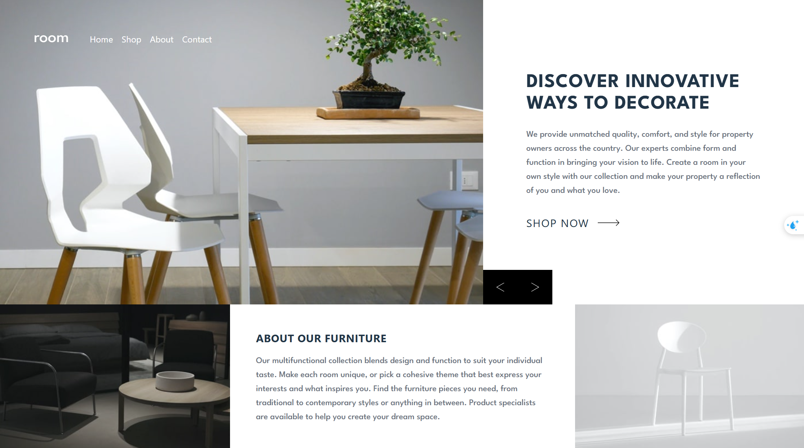
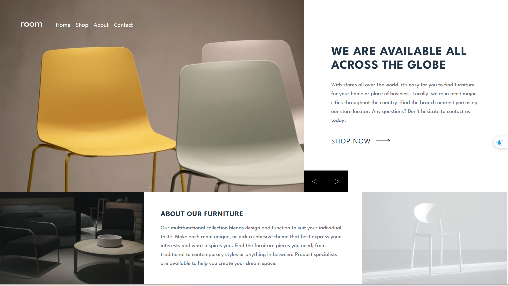
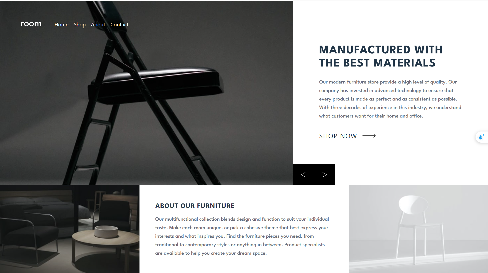

# Frontend Mentor - Room homepage solution

This is a solution to the [Room homepage challenge on Frontend Mentor](https://www.frontendmentor.io/challenges/room-homepage-BtdBY_ENq). Frontend Mentor challenges help you improve your coding skills by building realistic projects.

## Table of contents

- [Overview](#overview)
  - [The challenge](#the-challenge)
  - [Screenshot](#screenshot)
  - [Links](#links)
- [My process](#my-process)
  - [Built with](#built-with)
  - [What I learned](#what-i-learned)
  - [Continued development](#continued-development)
  - [Useful resources](#useful-resources)
- [Author](#author)
- [Acknowledgments](#acknowledgments)

**Note: Delete this note and update the table of contents based on what sections you keep.**

## Overview

### The challenge

Users should be able to:

- View the optimal layout for the site depending on their device's screen size
- See hover states for all interactive elements on the page
- Navigate the slider using either their mouse/trackpad or keyboard
- Toggle the mobile navigation menu

### Screenshot





### Links

- Solution URL: [Add solution URL here](https://github.com/khatupham1996/Room-Homepage)
- Live Site URL: [Add live site URL here](https://room-homepage-wine.vercel.app/)

## My process

### Built with

- Semantic HTML5 markup
- CSS custom properties
- Flexbox
- CSS Grid
- Mobile-first workflow
- [React](https://reactjs.org/) - JS library
- Vite - Build tool
- Tailwind CSS - For styles
- React Hooks (useState)

### What I learned

During this project, I learned how to effectively use CSS Grid with custom column sizing to create complex layouts. The hero section uses a 3:2 ratio while the about section uses a 1:2:1 ratio:

```html
<div className="grid grid-cols-1 lg:grid-cols-[3fr_2fr]">
  <div className="grid grid-cols-1 lg:grid-cols-[1fr_2fr_1fr]"></div>
</div>
```

```css
const [currentSlide, setCurrentSlide] = useState(0);
const nextSlide = () => {
  setCurrentSlide((prev) => (prev + 1) % slides.length);
};
const prevSlide = () => {
  setCurrentSlide((prev) => (prev - 1 + slides.length) % slides.length);
};
```

One key learning was ensuring images fill their grid containers without whitespace by using object-cover:

```html

```

I learned how to create a mobile-first responsive navigation with a hamburger menu that centers the logo properly by using flexbox with invisible spacers:

```html
<div className="flex items-center justify-between w-full">
  <button>Hamburger Menu</button>
  
  <div className="w-6 lg:hidden"></div>
  {/* Invisible spacer */}
</div>
```

### Continued development

In future projects, I want to focus on:

- Adding keyboard navigation support for the slider (arrow keys)
- Implementing smooth transitions/animations between slides
- Adding touch/swipe gestures for mobile devices
- Improving accessibility with proper ARIA labels
- Optimizing image loading with lazy loading
- Adding automated tests for the slider functionality

### Useful resources

- CSS Grid Generator - Helped me visualize custom grid layouts
- Tailwind CSS Documentation - Essential reference for utility classes
- React Documentation - useState - Great explanation of state management

## Author

- Website - Kha Tu Pham
- Frontend Mentor - @khatupham1996
- Github - @khatupham1996
